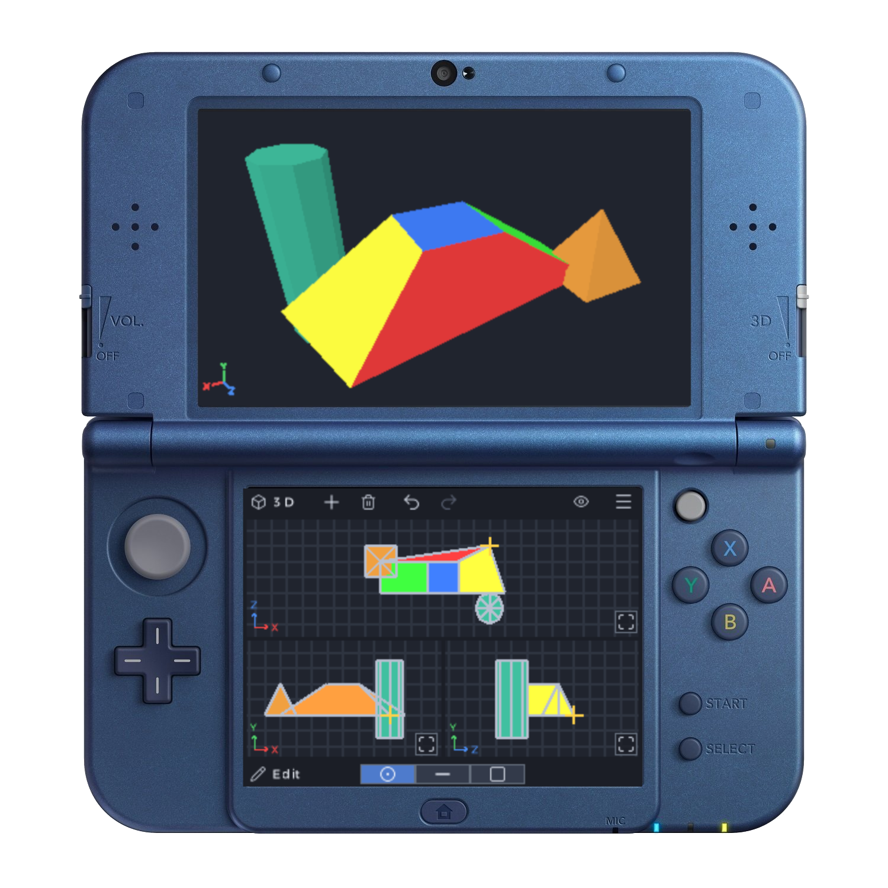

# whittle

**whittle** is an experimental homebrew low-poly 3D modelling app for the 3DS.

> [!IMPORTANT]
> **LOGO NEEDED**: If any artist wants to create a high quality 3D logo for whittle (preferably something whittling/wood related, maybe a low-poly bird woodcarving?) using whittle, I will make it the official logo :D 

> [!NOTE]
> Also if you're a 3D artist and liked whittle, **please contact me on Discord (@qewer33)**, I need feedback from artists to streamline the UX and add missing features.

## Installation

Move the `.3dsx` file in the Releases section to the `3ds/` folder on your SD card. Then launch it in the 3DS from the Homebrew Launcher.

## Usage

**whittle**'s workflow is *optimized for low-poly modelling* and is rather similar to that of **picoCAD**'s. whittle also takes advantage of the dual screens of the 3DS, the *top screen is reserved exclusively for the model preview*, while the *bottom touchscreen houses all of the editing functionality and view options*, intended to be used with the 3DS stylus.

whittle has two main *workspaces* (3D & 2D), the 3D workspca is for working with the general geometry and the 3D appereance of the model while the 2D workspace is for working on the texture atlas and UV mapping. Each workspace has different *modes* to do different tasks.

## 3D Workspace

The **3D workspace** has the base tools for 3D modelling, geometry editing and painting/texturing the model.

Below are a list of the modes in the 3D workspace with explanations:
- **Object**: The **Object mode** allows you to edit *whole* objects and apply the base transformations. It provides 3 tools: **Move**, **Rotate** and **Scale**.
- **Edit**: The **Edit mode** allows you to edit the individual geometry of objects. It provides 3 tools: **Vertex**, **Edge** and **Face**.
- **Paint**: The **Paint mode** allows you to paint faces of objects in soid colors. It provides 2 tools: **Brush** and **Picker**.
- **Texture**: The **Texture mode** allows you to texture the faces of objects. It provides 2 tools: **Texture** and **Untexture**.

## 2D Workspace

The **2D workspace** has tools for editing the texture atlas of the model and UV mapping the textured geometry faces onto the texture atlas.

Below are a list of the modes in the 2D workspace with explanations:
- **Paint**: The **Paint mode** provides a simple pixelart editor that allows you to edit the global 128x128 texture atlas. It provides 3 tools: **Brush**, **Bucket** and **Picker**.
- **UV**: The **UV mode** allows you to edit the UV maps of textured faces.

## Development

Written in C++ using devkitpro.

### Development Scripts

Some useful Bash (Linux CLI) scripts for development.

- `build.sh`: Builds the program to the `build/` folder.
- `run.sh`: Builds the program and opens it in Azahar (3DS emulator).
- `sync.sh`: Sends the program to a given FTP host (`FTP_HOST=<host>`). Useful for syncing the program to the 3DS.

### Modelling Engine

#### Mesh Representation

whittle works with meshes represented as a *"quad soup" format*, basically a collection of the shapes vertices and faces without any structural adjacency data attached (see `src/engine/mesh.cpp`). It's not ideal but works good enough for now for low-poly models, it will be improved in the future. This format also makes rendering very easy (see `src/engine/renderer.cpp`). Also triangles are stored as degenerate quads (last index repeated), so yeah everything is a quad.

#### Document Model

The model "document" is represented by the *Scene* (see `src/core/scene.cpp`). It holds a list of meshes, selection sets, the shared texture atlas and the undo/redo buffers. It does not contain any input or drawing code.

The Scene also holds the *actual 3D modelling operations*. Since we have no adjacency data in meshes rn, operations generally calculate the topology information they need locally on the fly.

### The Renderer

The renderer owns the **citro3d** pipeline (the 3D renderer from **devkitpro**). Everything rendered in 3D goes to a shader vertex format and a single very simple shader (see `src/engine/shaders/main.v.pica`).

As mentioned in the mesh representation section, since the meshes are quad soups, the renderer basically fans out and renders each quad as two triangles.

Also since the PICA200 (3DS's GPU) has no line primitive, wireframe/edges/grid/gizmo are CPU-projected and drawn as thin screen-space quads.

### Orthographic Viewports & Preview Camera

Orthographic viewports are where the editing happens on the bottom screen. The *Viewport* is basically a single ortho view (see `src/engine/viewport.cpp`), it handles it's own projection matrix and also converts the bottom screen stylus taps to it's world coordinates.

The top preview is rendered with a *Camera* (see `src/engine/camera.cpp`), it handles zoom/pan/orbit.

### Interaction Engine
